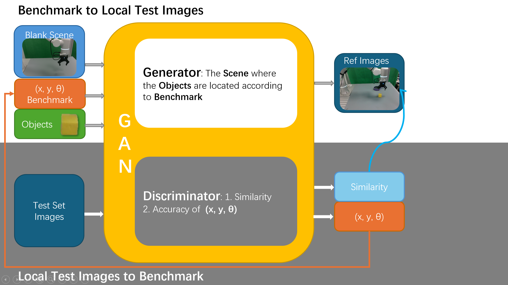

# Benchmark to Ref Image with GAN

## Background

When studying embodied intelligence🤖, our test sets are often stored in the form of `ref images`, loaded in the eval stage, and mixed with the images obtained by the real-time camera so that researchers🤓 can place objects such as blocks strictly according to the test set. 

However, if an open source benchmark is used, problems such as 
1. The research scenario is different, and the image data cannot be used directly.
2. Parameters such as coordinate angles need to be manually measured and placed, which is a time-consuming and labor-intensive process and researchers cannot do other things in parallel🥲

will be encountered.

To solve this problem, a model that generates a reliable ref image based on the scene and coordinates is necessary.



## Usage

```bash
# ~/B2R-GAN/
bash run.sh
```